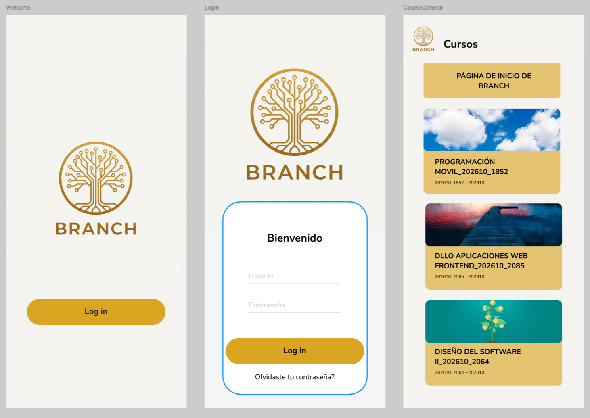
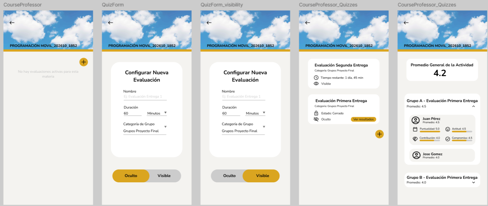
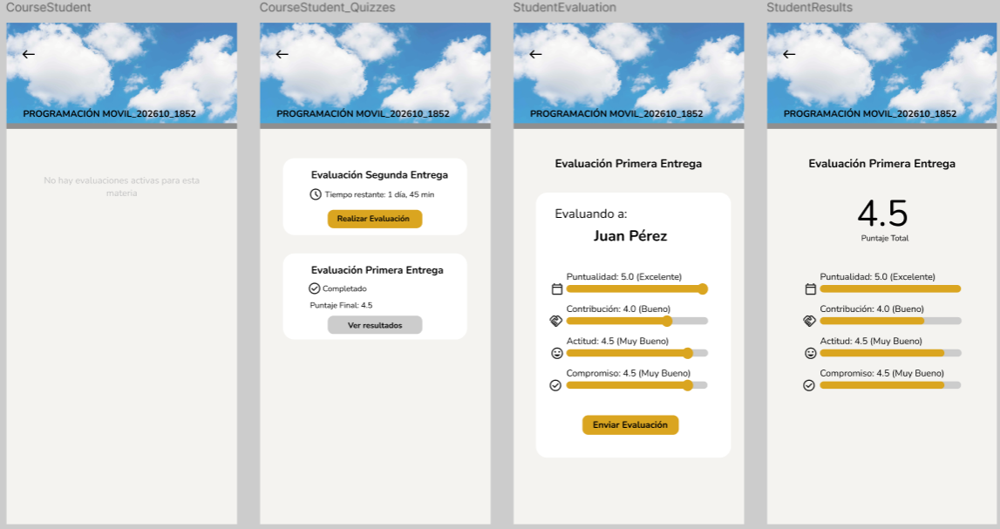

Propuesta Individual: Branch App
Estudiante: Jorge David Imitola Rueda

1. Referentes Analizados
Para el diseño de esta solución se tomaron como base las siguientes plataformas:

*Buddycheck: Destaca por su capacidad de integrarse con sistemas como Brightspace para la gestión automática de grupos.

*CATME (Comprehensive Assessment of Team Member Effectiveness): Proporciona un modelo de rúbricas basado en comportamientos específicos, similar a los requerimientos de este proyecto.

*Google Classroom: Se tomó como referente para el flujo de invitaciones a cursos y la distinción clara entre el panel del profesor y el del alumno.

2. Composición y Diseño de la Solución
Se propone el desarrollo de una sola aplicación móvil con acceso basado en roles (Profesor y Estudiante).

Justificación de la Arquitectura

*Clean Architecture: La app se dividirá en capas de Datos, Dominio y Presentación para asegurar que el código sea mantenible y escalable.

*GetX: Se utilizará este paquete para gestionar el estado de la aplicación, la navegación entre pantallas y la inyección de dependencias de forma sencilla.

*Centralización: Al usar una sola app, se facilita la gestión de la autenticación y el almacenamiento a través de los servicios de Roble.

3. Descripción del Flujo Funcional
El flujo de la aplicación se divide en las siguientes fases:

*Fase 1: Configuración y Onboarding

Registro y Roles: El usuario inicia sesión; el sistema identifica si es Profesor o Estudiante.

Importación de Estructura: El docente vincula el curso y realiza la importación obligatoria de las categorías de grupos desde Brightspace.

*Fase 2: Lanzamiento de la Evaluación

Activación: El profesor selecciona una categoría de grupo y empieza una evaluación.

Parámetros: Se define el nombre, la ventana de tiempo (duración en horas/minutos) y la visibilidad (Pública o Privada).

Notificación: Gracias a los permisos de segundo plano (background), los estudiantes reciben una alerta inmediata de que la evaluación ha comenzado.

*Fase 3: Proceso de Evaluación (UX del Estudiante)

Acceso Geolocalizado: La app verifica la ubicación del estudiante (si el profesor lo requiere) para validar la participación.

Rúbrica Digital: El estudiante califica a cada compañero de su grupo (la autoevaluación está deshabilitada).

Criterios de Evaluación: Se asignan puntajes de 2.0 a 5.0 en cuatro áreas clave: puntualidad, contribuciones, compromiso y actitud.

*Fase 4: Cierre y Analítica de Resultados

Consolidación: Una vez cerrada la ventana de tiempo, los datos se almacenan de forma segura en Roble.

Vista del Profesor: Accede a un dashboard con promedios automáticos por actividad, por grupo y por estudiante, con opción de ver el detalle por criterio.

Vista del Estudiante: Si el profesor configuró la visibilidad como Pública, el alumno podrá ver su retroalimentación (puntajes de criterios y puntaje general) para mejorar en futuras actividades.

4. Justificación de la Propuesta

Esta propuesta se justifica en la optimización de recursos para un equipo de desarrollo de nivel inicial, eligiendo una arquitectura de aplicación única con roles para garantizar una implementación coherente con Clean Architecture y GetX sin duplicar esfuerzos técnicos en múltiples proyectos (dos o mas aplicaciones). Ademas, en terminos de mantenimiento es mucho más fácil corregir un error o subir una actualización a una sola tienda de aplicaciones que gestionar dos proyectos por separado. Asi, el diseño prioriza una experiencia de usuario comprensible y fluida para capturar con precisión los cuatro criterios de evaluación exigidos: puntualidad, contribuciones, compromiso y actitud.

5. Prototipo en Figma y Capturas
Enlace al Prototipo: https://www.figma.com/design/Gaz6mvKKVn9Pf6O2THJmLC/Dart-app?node-id=0-1&p=f&m=draw

Capturas de Pantalla:

6. Elementos Adicionales

* Indicadores de Progreso Visual: Implementación de una barra de progreso que muestre al estudiante cuántos compañeros le falta por evaluar en tiempo real.

* Código de Colores Semafórico (Rúbricas): Los puntajes se mostrarán con colores dinámicos: rojo para "needs improvement" (2.0), amarillo para "Adequate" (3.0), verde suave para "Good" verde fuerte para "Excellent" (5.0). Esto facilita al profesor la identificación visual rápida de estudiantes en riesgo.

* Confirmación de Envío con GetX: Antes de finalizar la evaluación, se mostrará un cuadro de diálogo resumiendo las calificaciones otorgadas, evitando envíos accidentales o errores de dedo.