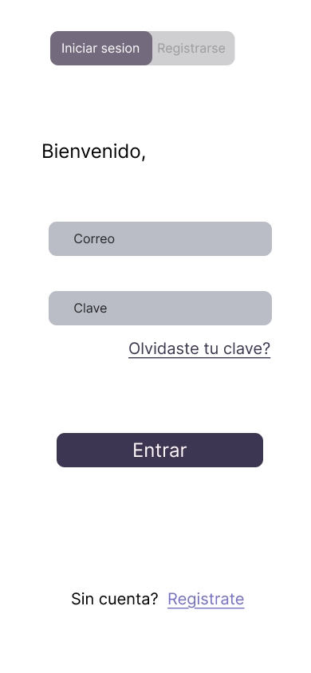
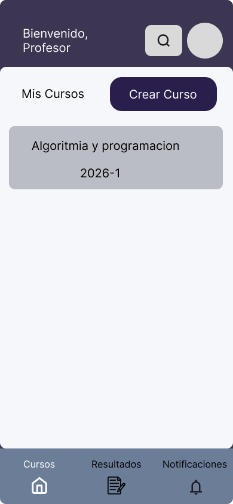
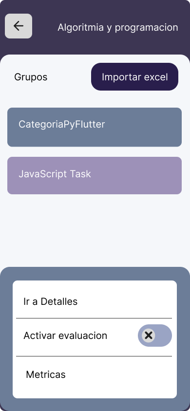
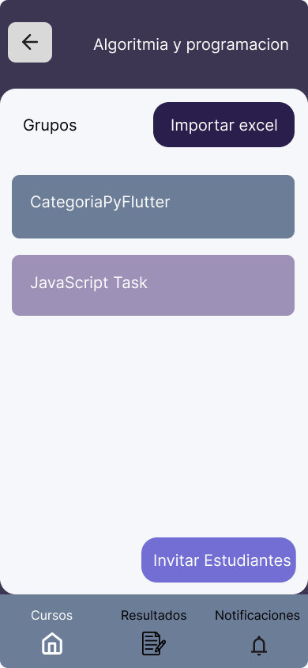
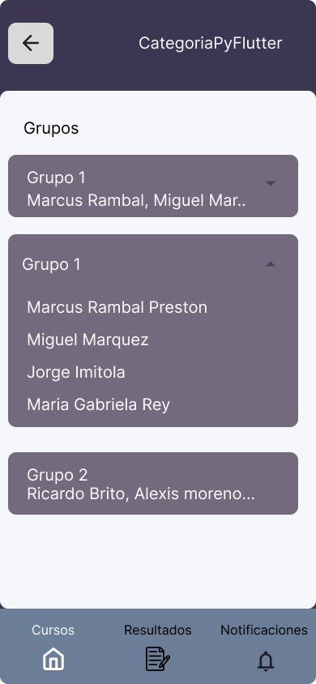
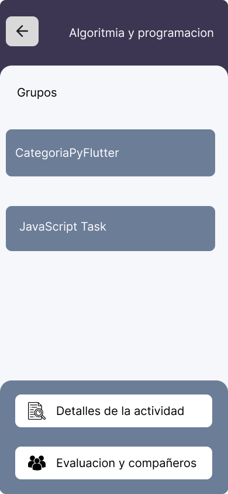
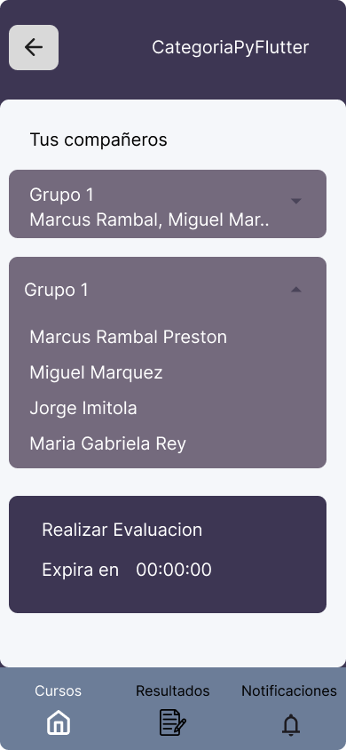
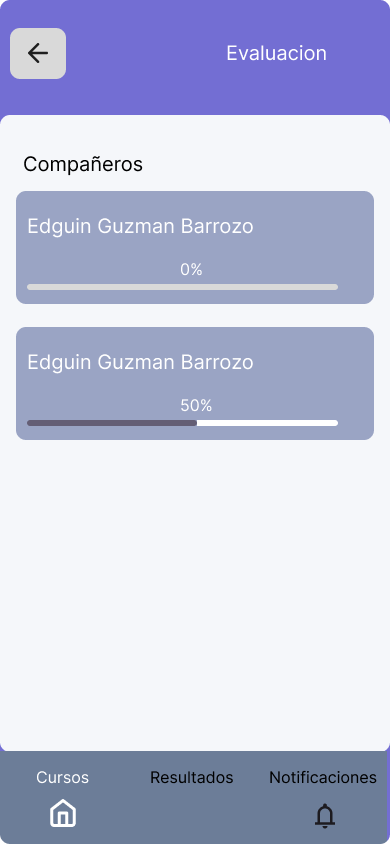
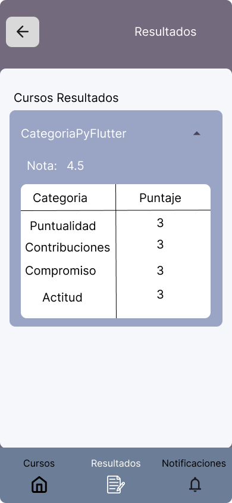
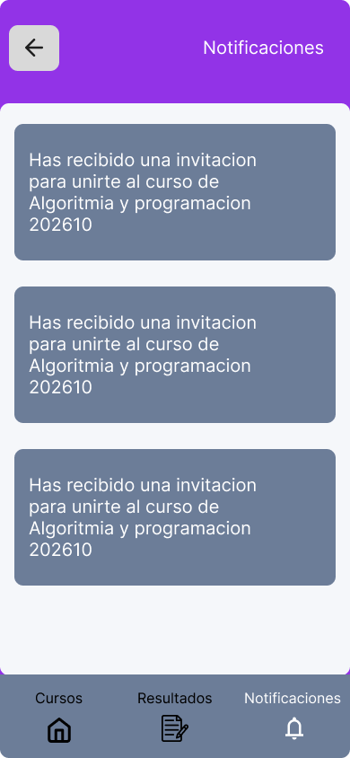

# Propuesta Aplicación

## Tres referencias

- FeedBackFruit
- Evaluación docente de la universidad
- Peerceptiv

Preeceptiv fue la referencia principal al momento de realizar la propuesta, ya que tiene enfasis en la retroalimentacion entre compañeros de grupo.

---

## Arquitectura propuesta

Para realizar la aplicacion se propone una sola aplicacion con sistema de roles para identificar
a los usuarios con roles tanto de profesores como estudiantes y dependiendo del rol se le muestra
la interfaz y funciones correspondientes.

Para ello la app se dividira en varias capas:

### Capa de datos y autenticacion
Aqui es donde ira la autenticacion y la base de datos

### Capa de interfaz
Aqui ira la interfaz que se define dependiendo del rol del usuario

---

## Descripción detallada del flujo funcional

### Flujo del Docente

En el apartado del docente este podra logearse mediante la autenticacion con roble, posteriormente podra crear un
curso donde podra invitar estudiantes, a su vez podra importar el archivo de excel, una vez importado el archivo de 
excel se le mostraran las actividades y al presionar sobre ellas podra ver los grupos que conforman las actividades,
al presionar sobre una actividad podra ver las metricas que sera un archivo excel con toda la informacion relevante 
a la actividad (media del curso , media por grupo, media por estudiante), tambien podra activar la evaluacion asociada a la actividad. 

### Flujo del Estudiante

En el caso del estudiantes podra ver sus cursos, al presionar sobre ellos podra ver los detalles (compañeros) y realizar la evaluacion del grupo si esta disponible, en el apartado de evaluacion se le hara una encuesta para que evalue a sus compañeros, y finalmente podra ver sus metricas generales de la actividad y las notificaciones de invitacion a cursos.

---

## Justificación de la propuesta

Con base en los referentes analizados y en entrevistas realizadas a profesores que implementen trabajos colaborativos.

Conversando con la profesora Rocio Ramos, llegamos a que una sola aplicacion con roles era una solucion factible, ademas se descato FeedbackFruits como herramienta que la profesora esta usando actualmente y menciono que las
metricas arrojadas no eran muy utiles para el analisis para ello en el apartado de encuesta se tiene la siguente propuesta: En la encuesta necesitamos preguntas que midan comportamientos observables y frecuencia, lo que permitirá cruzar datos y encontrar patrones, a continuacion se muestran ejemplos de las preguntas:

### Ejemplos de preguntas de encuesta

**Pregunta 1:** Al recibir una crítica constructiva o corrección, ¿cuál es la reacción predominante del compañero?
- Defensiva
- Aceptacion pasiva
- Proactivo hacia el cambio

**Pregunta 2:** Si tuvieras una duda , ¿qué tan predispuesto percibes a este compañero para detener sus labores y explicarte?
- Muy poco dispuesto
- Poco dispuesto
- Dispuesto
- Muy dispuesto

**Pregunta 3:** ¿Qué tan seguro te sientes al integrar el trabajo de este compañero en el tuyo sin realizar una investigacion previa?
- Nada seguro
- Poco seguro
- Seguro
- Totalmente seguro

La idea es que este tipo de preguntas sirvan para entender como la actitud individual se traduce en resultados colectivos y facilitando intervenciones pedagógicas

---

## Enlace prototipo FIGMA

[Abrir prototipo en Figma](https://www.figma.com/design/oBLF7jJv8gcLZ9mn8zJGEO/gestPalette?node-id=29-54&t=7hqSzzE44vwVFrJu-1)

## Pantallas de la Aplicación

#### Pantalla de Login

### Vistas del Profesor

#### Layout Principal Profesor

#### Botón Cursos

#### Cursos del Profesor

#### Grupos del Profesor

### Vistas del Estudiante

### Notificaciones

